---
options:
  implicit_slide_ends: true
theme:
  override:
    footer:
      style: template
      left: "Jeevan | MongoDB HYD"
      right: "{current_slide} / {total_slides}"
---

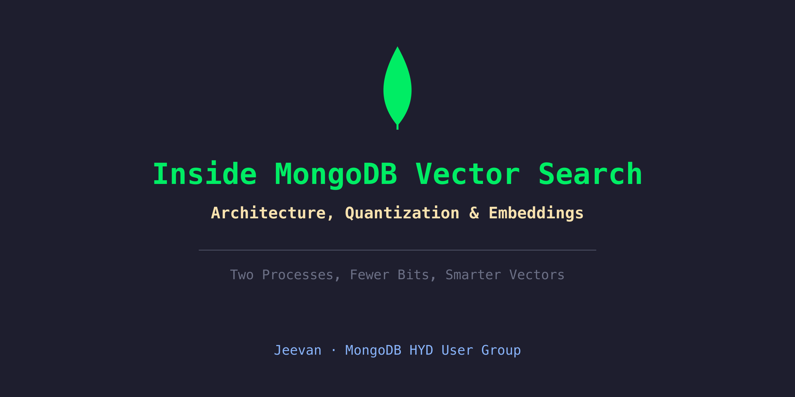

<!-- end_slide -->

# This Is All It Takes

```js
db.docs.aggregate([
  { $vectorSearch: {
      index: "vector_index",
      path: "embedding",
      queryVector: [0.21, 0.87, ...],
      numCandidates: 200,
      limit: 10
  }}
])
```

<!-- pause -->

<span style="color: #f9e2af">Six lines. One stage.</span>

**This talk is everything under the waterline.**

<!-- pause -->

<span style="color: #6c7086">The goal: leave knowing the machine — not the API.</span>

<!-- end_slide -->

# Two Bets Hiding Under One Query

<!-- new_lines: 5 -->

<!-- column_layout: [1, 1] -->

<!-- column: 0 -->

## 🏗️ Where does the index live?
*Architecture — `mongot` and the change stream*

<!-- column: 1 -->

## 🗜️ How do billions fit in RAM?
*Compression — quantization and its levers*

<!-- reset_layout -->

<!-- pause -->

<span style="color: #a6e3a1">Each one is a deliberate engineering bet. Let's open the box.</span>

<!-- end_slide -->

# &nbsp;

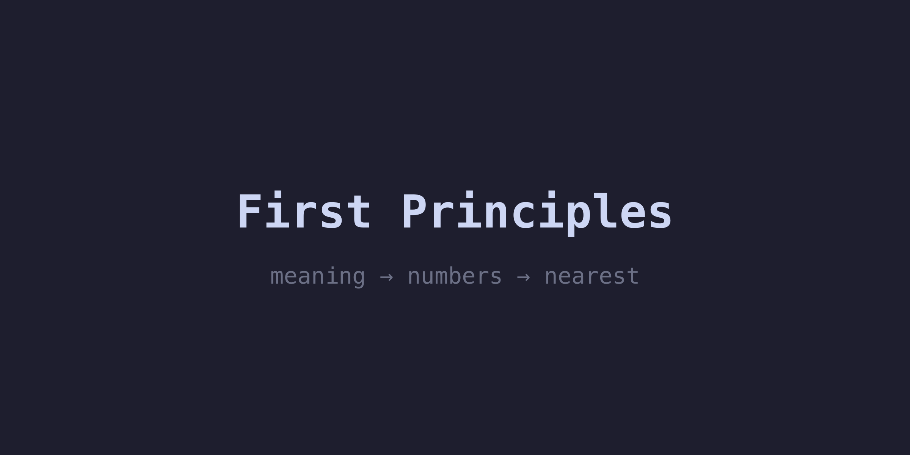

<!-- end_slide -->

# Recap: An Embedding Is Meaning as Numbers

```
┌──────────────────────────┐        ┌──────────────────────────┐
│     "I love biryani"     │   vs   │  "Biryanis are awesome"  │
└──────────────────────────┘        └──────────────────────────┘
```

**How do we teach a computer these two are saying the same thing?**

<!-- pause -->

<!-- column_layout: [3, 2] -->

<!-- column: 0 -->

```
"I love biryani"        → [0.2, 0.8, 0.1, ...]
"Biryanis are awesome"  → [0.3, 0.7, 0.2, ...]
"The sky is blue"       → [0.9, 0.1, 0.8, ...]
```

<!-- pause -->

<span style="color: #a6e3a1">Similar meaning → similar numbers.</span>

<!-- column: 1 -->


<!-- reset_layout -->

<!-- pause -->

<span style="color: #6c7086">A GPS coordinate for meaning. That's the whole trick.</span>

<!-- end_slide -->

# Recap: "Close" Is Just Distance

<!-- column_layout: [1, 1] -->

<!-- column: 0 -->

**Two points → Pythagoras**

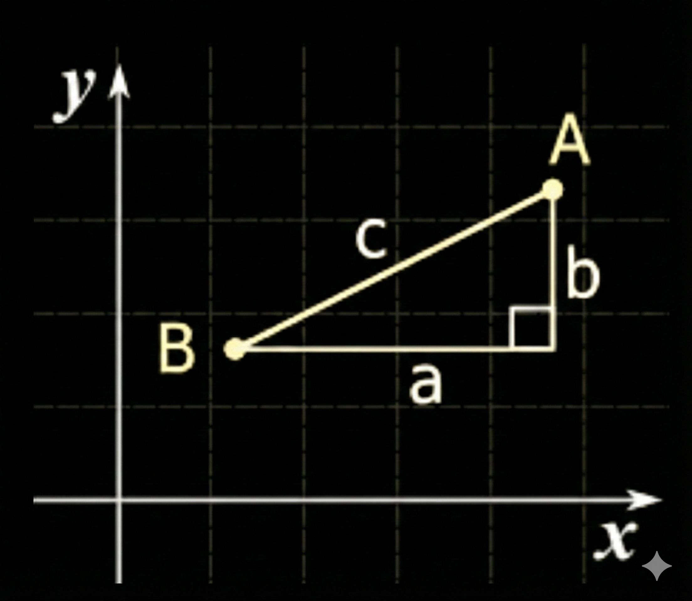

`distance c = √(a² + b²)`

<!-- column: 1 -->

**Many dims → cosine**

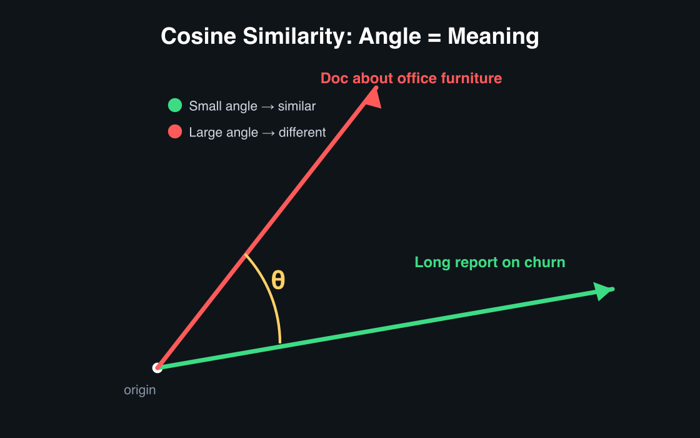

<!-- reset_layout -->

<!-- pause -->

<span style="color: #f9e2af">Same idea in 1024 dimensions — cosine compares *direction*, so vector length never distorts meaning.</span>

<!-- end_slide -->

# &nbsp;

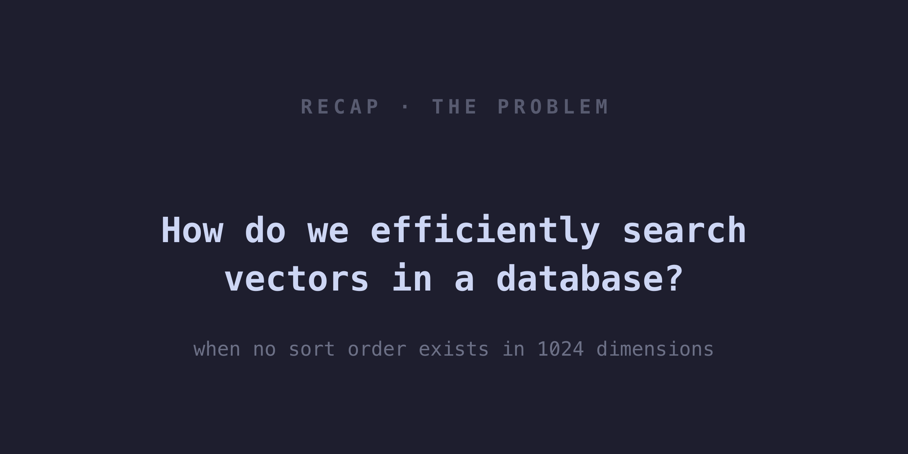

<!-- end_slide -->

# Recap: Why a Normal Index Can't Do This

<!-- column_layout: [1, 1] -->

<!-- column: 0 -->

**A B-tree sorts.** Binary search, O(log n).


<!-- column: 1 -->

**A vector has no sort order.**

```
A = [0.21, 0.87, ..., 0.53]
B = [0.93, 0.12, ..., 0.71]
```


<!-- reset_layout -->

<!-- pause -->

<span style="color: #f9e2af">No "less than" in 1024 dims → exact search checks every vector — too slow at scale.</span>

<!-- end_slide -->

# How ANN (Approximate Nearest Neighbor) Indexes Work

**Close enough — without checking every vector.**


**<span style="color: #4EC9B0">HNSW</span>** — Hierarchical Navigable Small World · multi-layer graph · ~95-99% recall · <span style="color: #f38ba8">must stay in RAM</span>

<!-- pause -->

*Like driving city → suburb → street: expressway (top layer, big hops) → regional road → local street to the door (precise).*

<!-- pause -->

<span style="color: #a6e3a1">ANN = Approximate Nearest Neighbor: ~99% as good as exact scan, 100x faster.</span>

<!-- end_slide -->

# &nbsp;

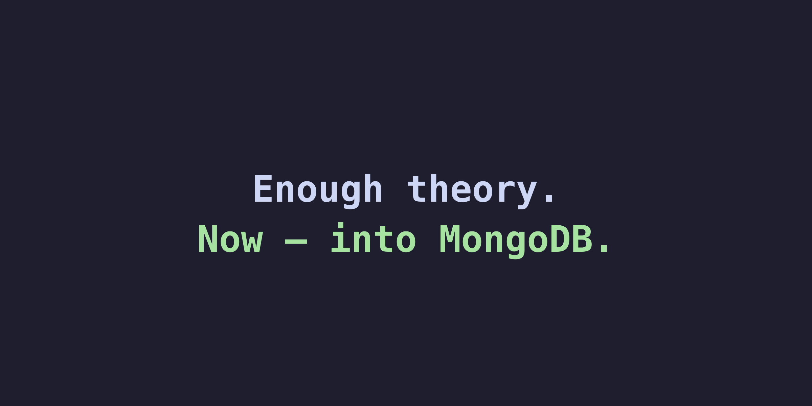

<!-- end_slide -->

# Recap: In MongoDB, a Vector Is Just a Field

```js
{
  _id: ObjectId("..."),
  title: "How to cancel my subscription",
  content: "Unsubscribe anytime from the account settings page...",
  embedding: [0.21, 0.87, 0.14, /* ...1024 numbers... */ 0.53]
}
```

A normal document. A normal array.

<span style="color: #a6e3a1">**That's the input. Now — where does the *index* live?**</span>

<!-- end_slide -->

# A Stored Vector Is Inert

<!-- column_layout: [1, 1] -->

<!-- column: 0 -->

```js
// Index creation — the key parameters
db.createSearchIndex("vsindex", "vectorSearch", {
  fields: [{
    type: "vector",
    path: "embedding",
    numDimensions: 1024,
    similarity: "cosine",
    quantization: "binary"   // scalar | binary
  }]
})
```

<!-- column: 1 -->

```js
// Query — the key parameters
db.docs.aggregate([
  { $vectorSearch: {
      index: "vsindex",
      path: "embedding",
      queryVector: [0.21, 0.87, ...],
      numCandidates: 200,   // ← recall ↔ latency dial
      limit: 10
  }}
])
```

<!-- reset_layout -->

<!-- pause -->

<span style="color: #6c7086">Both sides matter: how the index is *built* (left) and how it's *queried* (right).</span>

<!-- end_slide -->

# `numCandidates`: The Recall ↔ Latency Dial

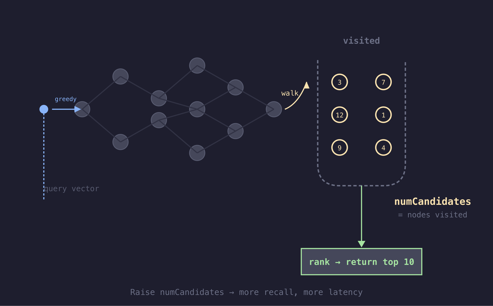

<!-- pause -->

<span style="color: #f9e2af">`numCandidates` = how many nodes the HNSW walk visits.</span>

<!-- pause -->

**So how do you pick that number?**

<span style="color: #6c7086">Rule of thumb: start at 10–20 × `limit`. Hard cap: 10,000.</span>

<span style="color: #a6e3a1">Then don't guess — measure. Coming up: ENN as a free ground truth.</span>

<!-- end_slide -->

# &nbsp;

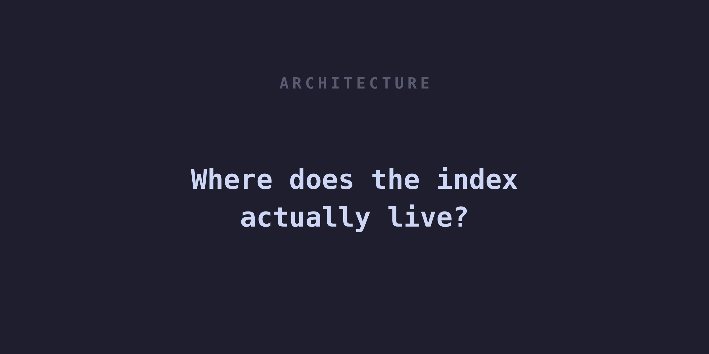

<!-- end_slide -->

# The Obvious Design

**Expectation:** the vector index lives *inside* the database — built as writes land, same process, same transaction.

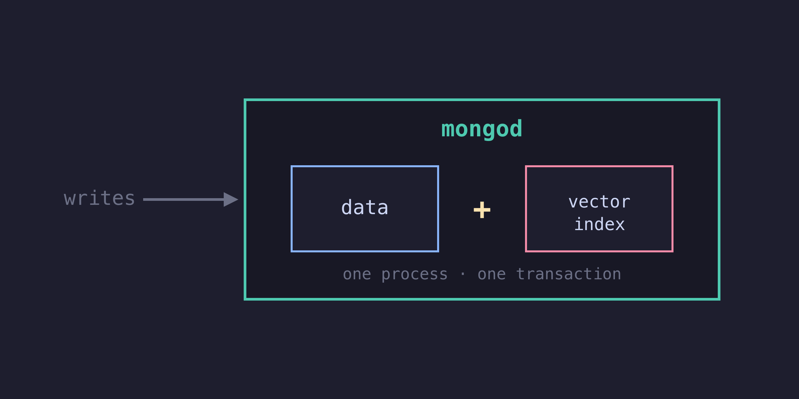

<!-- pause -->

<span style="color: #f9e2af">MongoDB deliberately **doesn't** do this.</span>

<span style="color: #6c7086">And that one choice explains almost everything else.</span>

<!-- end_slide -->

# The Bet: A Second Process

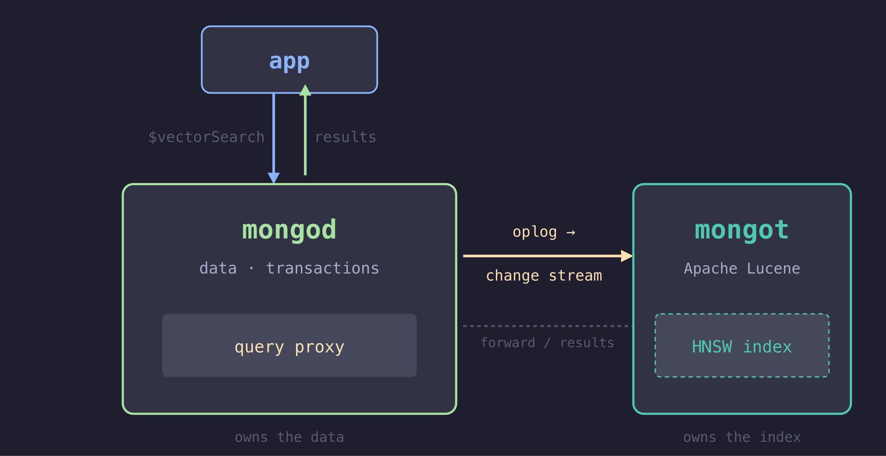

<!-- pause -->

<span style="color: #a6e3a1">Two processes. One connection string.</span> <span style="color: #6c7086">The split is invisible to the app.</span>

<!-- pause -->

<span style="color: #f9e2af">The pattern under everything: **never work on the write path.**</span>


<!-- end_slide -->

# Two Engines, Opposite Physics

**Why not just build the index into `mongod`? Because search and transactions want opposite things.**

<!-- pause -->

<!-- column_layout: [1, 1, 1] -->

<!-- column: 0 -->

<span style="color: #4EC9B0">**`mongod` / WiredTiger**</span>

**Runtime** · C++
**Workload** · OLTP · point reads & writes · txns
**Storage** · mutable B-trees, updated in place
**Memory** · low-latency, steady

<!-- column: 1 -->


<!-- column: 2 -->

<span style="color: #4EC9B0">**Lucene (`mongot`)**</span>

**Runtime** · JVM
**Workload** · search · text + vector
**Storage** · immutable segments · merges · HNSW
**Memory** · memory-hungry, bursty, GC-driven

<!-- reset_layout -->

<!-- pause -->

Share one process and a search OOM takes down the database; a GC pause stalls writes.

<span style="color: #f9e2af">Different memory models, different failure domains → different processes.</span>

<!-- pause -->

<span style="color: #6c7086">And MongoDB didn't *write* a vector index — it reuses **Lucene** (20+ yrs of search, now with HNSW). One engine, two query types: `$search` (text) and `$vectorSearch`.</span>

<!-- pause -->

<span style="color: #f9e2af">And Lucene *fits*, structurally —</span> <span style="color: #6c7086">immutable segments ≈ how HNSW wants to live.</span>


<!-- end_slide -->

# How `mongot` Stays in Sync

**A downstream consumer of the change stream — in two phases.**

<!-- pause -->

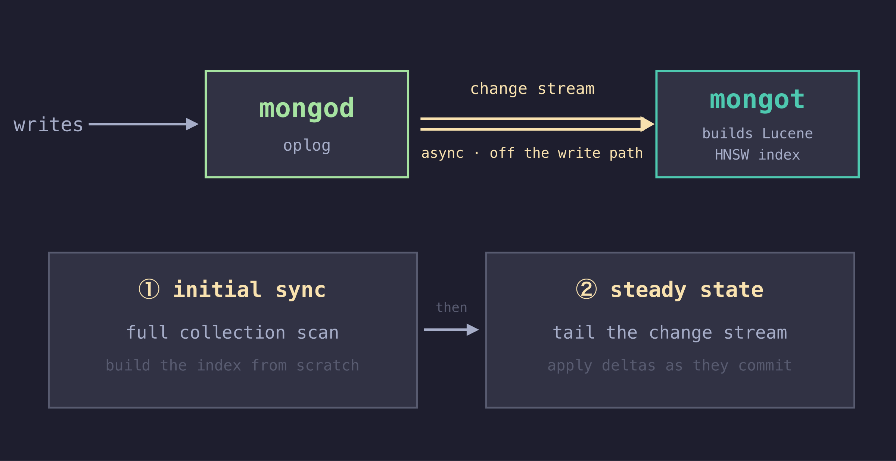

<!-- pause -->

- No index work inside the transaction commit window
- Indexing runs **asynchronously**, off the hot path
- Writes never wait for the index

<!-- pause -->

<span style="color: #a6e3a1">Mental model: `mongot` is a **read replica that speaks Lucene**.</span>


<!-- pause -->

<span style="color: #f9e2af">A **subscriber**, not a **passenger**.</span> <span style="color: #6c7086">Freshness = stream lag.</span>

<!-- end_slide -->

# Nobody Talks to `mongot` Directly

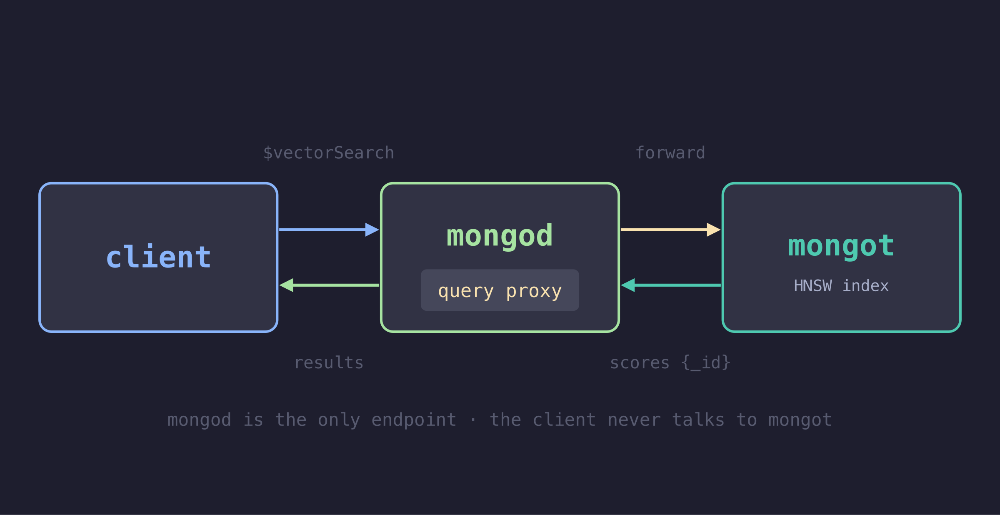

<!-- pause -->

`mongot` scores and returns **just `{_id, score}`** — it doesn't store the documents, only the indexed fields. `mongod` stays the source of truth and **rehydrates** the full docs before the rest of the pipeline runs.

<!-- pause -->

<span style="color: #a6e3a1">Why IDs, not documents? No wholesale data duplication · `mongod` stays authoritative · results still flow into `$project` / `$lookup` after search.</span>

<span style="color: #6c7086">The cost: one id-lookup round trip. One connection string. (Sharded: `mongos` fans out and merges.)</span>

<!-- end_slide -->

# The Index Is a Materialized View

**Search reads a *derived, lagging view* — not the collection.**


<!-- pause -->

<!-- column_layout: [1, 1] -->

<!-- column: 0 -->

<span style="color: #f38ba8">**Catch**</span>
No read-your-writes for search.

<!-- column: 1 -->

<span style="color: #a6e3a1">**Subtlety**</span>
Stale = which docs *match*, never the body.

<!-- reset_layout -->

<!-- pause -->

<span style="color: #f9e2af">Eventually-consistent results · strongly-consistent documents.</span>


<!-- end_slide -->

# `$vectorSearch` Is Just a Pipeline Stage

```js
db.docs.aggregate([
  { $vectorSearch: { /* semantic + on-doc filter */ } },
  { $lookup:  { from: "users", localField: "userId", foreignField: "_id", as: "user" } },
  { $match:   { "user.plan": "pro" } },   // post-filter: joined field
  { $project: { title: 1, score: { $meta: "vectorSearchScore" } } }
])
```

<!-- pause -->

<span style="color: #a6e3a1">Results flow into `$lookup`, `$match`, `$group`, `$project` — joins, filters, reshaping, one query. Why a database, not a bolt-on vector store.</span>

<!-- pause -->

<span style="color: #a6e3a1">`$vectorSearch` must be the **first** stage — it's a *source*, not a filter.</span>

<!-- pause -->

<span style="color: #f9e2af">So every later stage runs *after* the ANN walk.</span> <span style="color: #6c7086">Pre-vs-post is a consequence, not a rule.</span>


<!-- end_slide -->

# Filtering: *Where* It Runs Decides If It Works

**B-tree index:** knows every value → filter by tenant = a direct, exact lookup. Never misses.

**HNSW index:** knows only *proximity*, not "tenant" — blind to any filter applied *after* the walk.

<!-- pause -->

**Post-filter:** graph walk finds 10 nearest (all wrong tenant) → `$match` throws away all 10 → **0 results**.


<!-- pause -->

<span style="color: #6c7086">A B-tree can't lose rows — it points at exact values. HNSW can "lose" rows — it points at *nearest* vectors, and only sees your filter if it's built into the walk.</span>

<!-- end_slide -->

# Demo — The Filter Trap

<!-- column_layout: [1, 1] -->

<!-- column: 0 -->

**Post-filter** — `$match` after
```js
$vectorSearch → $match:{tenant:42}
```
<span style="color: #f38ba8">Got: 0</span>

<!-- column: 1 -->

**Pre-filter** — `filter` inside
```js
$vectorSearch:{ filter:{tenant:42} }
```
<span style="color: #a6e3a1">Got: 10</span>

<!-- reset_layout -->

<!-- pause -->

<span style="color: #f9e2af">Same query, same data — the only change is *where* the filter runs.</span>

<span style="color: #a6e3a1">Pre-filter fixes it: the predicate runs *inside* the HNSW walk, not after.</span>

<span style="color: #6c7086">Live on local MongoDB: `mongod` + `mongot` in one container.</span>

<!-- end_slide -->

# Bonus: Text + Vector, One Engine

<!-- column_layout: [2, 1] -->

<!-- column: 0 -->

**Vector search misses exact terms. Keyword search misses meaning.**

```text
Query: "error code ERR-4521"
├─ Vector  → returns docs about "connection timeout errors" (semantically close,
│            wrong code — ERR-4521 and ERR-4522 look nearly identical as vectors)
├─ BM25    → matches "ERR-4521" exactly              (precise)
└─ Combined → best of both
```

<!-- column: 1 -->


<!-- reset_layout -->

<!-- pause -->

<span style="color: #f38ba8">Embeddings compress exact tokens (IDs, codes, SKUs) into "nearby," not "identical." Vector search alone can't tell ERR-4521 from ERR-4522.</span>

<!-- pause -->

**`mongot` already indexes both. Fuse them in one query.**

```js
db.docs.aggregate([
  { $rankFusion: { input: { pipelines: {
      vector: [ { $vectorSearch: { /* semantic */ } } ],
      text:   [ { $search:       { /* BM25 keyword */ } } ]
  }}}}
])
```

<!-- pause -->

<span style="color: #a6e3a1">Reciprocal Rank Fusion blends the two — keyword precision + semantic recall.</span>

<span style="color: #6c7086">Fuses by **rank**, not score (cosine 0–1 ≠ BM25 unbounded). One engine, no second system.</span>

<!-- pause -->

<span style="color: #6c7086">Live on local MongoDB: `demo/03-rank-fusion` — same exact-code example, real `$rankFusion`.</span>


<!-- end_slide -->

# The Two Kitchens

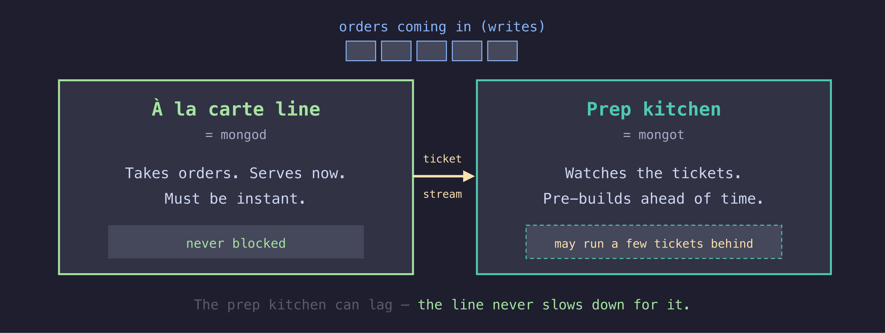

<!-- pause -->

<span style="color: #f9e2af">The prep kitchen can fall behind — and the front of house never even slows down.</span>

<!-- end_slide -->

# Surviving a Crash: Resume Tokens

<!-- column_layout: [1, 2] -->

<!-- column: 0 -->

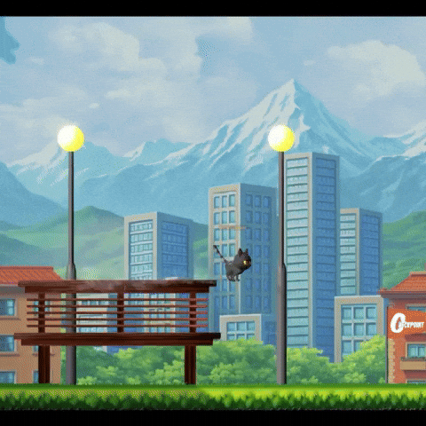

<!-- column: 1 -->

**What if `mongot` restarts mid-stream?**

<!-- pause -->

```
last processed change → resume token
        │
        ├─ still in the oplog window → resume, catch up
        │
        └─ history gone / lost state → re-sync (full rebuild)
```

<!-- reset_layout -->

<!-- pause -->

<span style="color: #a6e3a1">Usually it just catches up.</span> <span style="color: #f9e2af">Fall behind the oplog window and it rebuilds — queries stay up but read stale until it's caught up.</span>

<!-- end_slide -->

# Where Does `mongot` Run?

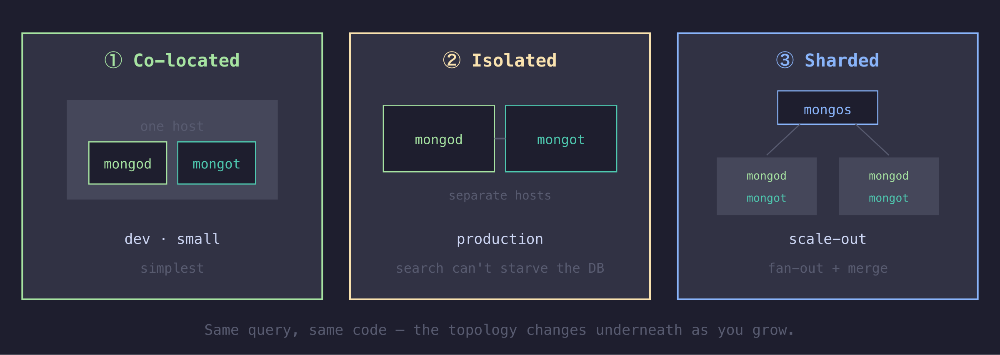

<!-- pause -->

<span style="color: #6c7086">Start co-located, isolate under load, shard to scale out — same query throughout.</span>

<span style="color: #a6e3a1">Co-located = the **Sidecar pattern**: `mongot` rides alongside `mongod`, same host, same lifecycle.</span>

<!-- pause -->

<span style="color: #f9e2af">Sharded: each shard runs its own `mongot` over its own data — HNSW is **per-shard**, so `numCandidates` applies per shard and `mongos` merges the scored results.</span>

<!-- end_slide -->

# Architecture — The Mental Model


<!-- pause -->

<span style="color: #f9e2af">One pattern under all four: **defer and derive.**</span>

<span style="color: #6c7086">CQRS (write model / read model) · Materialized View (derived, lagging) · Event-log projection (oplog replay) · Proxy (mongod fronts mongot) · Bulkhead (separate failure domains) · Sidecar (mongot rides alongside mongod, same lifecycle)</span>

<!-- pause -->

<span style="color: #6c7086">And PACELC: no partition → the tradeoff is **Latency vs Consistency**. MongoDB picks latency (writes never wait) at the cost of a stale index.</span>


<!-- end_slide -->

# &nbsp;

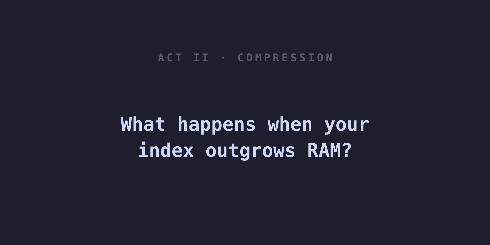

<!-- end_slide -->

# We Understand the Architecture — Now the Scale Problem

**We've seen how MongoDB separates search from transactions.**

**But when you put 100M vectors behind that architecture, the RAM bill still explodes.**

<!-- pause -->


<!-- pause -->

<span style="color: #f9e2af">The index structure is elegant. The memory footprint is brutal.</span>

<!-- end_slide -->

# Why Compression Isn't Optional

<!-- column_layout: [3, 2] -->

<!-- column: 0 -->

```
one vector:  1024 dims × 4 bytes ≈ 4 KB
```

| docs | just the vectors |
|------|------------------|
| 1M   | ~4 GB |
| 10M  | ~40 GB |
| 100M | ~400 GB |

<!-- column: 1 -->

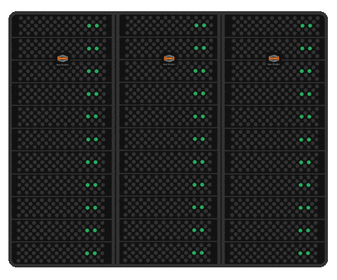

<!-- pause -->


<!-- reset_layout -->

<!-- pause -->

<span style="color: #f38ba8">HNSW wants those vectors in RAM.</span> <span style="color: #f9e2af">RAM is the bill.</span>

<!-- pause -->

**And at distributed scale:**

- Sharding spreads data, but each shard still needs its HNSW in RAM
- `numCandidates` applies **per shard** → recall shifts as you add shards
- A search OOM on one shard can starve the others
- Rebuilds, rebalancing, and hot-spotting all hit the same memory wall

<span style="color: #6c7086">Compression isn't a nice-to-have. It's the difference between "scales" and "doesn't."</span>

<!-- end_slide -->

# Three Levers, Not One

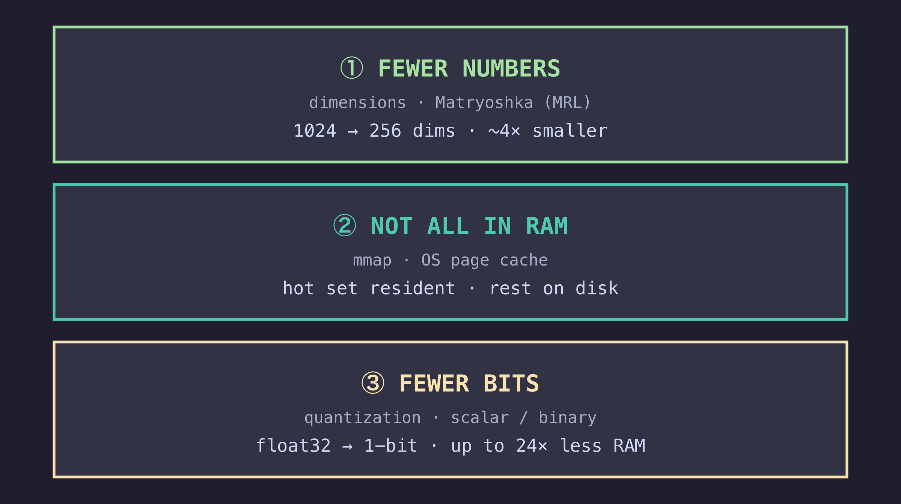

<!-- pause -->

<span style="color: #6c7086">Quantization is just the loudest lever.</span>

<!-- end_slide -->

# Lever ① — Fewer *Numbers* (dimensions)


<!-- pause -->

**Matryoshka (MRL):** training packs meaning into the front dims → truncating is safe.

```
2048 dims → 1024 dims → 512 dims → 256 dims
```

<!-- pause -->

<span style="color: #f9e2af">Start small, measure recall. If 256 dims works, no need to store 1024.</span>

<span style="color: #6c7086">RAM scales with dimensions. Halve them → halve the vector RAM.</span>

<!-- end_slide -->

# Lever ② — Not All of It Has to Be in RAM

**`mongot` is Lucene. Lucene reads its index through `mmap`.**

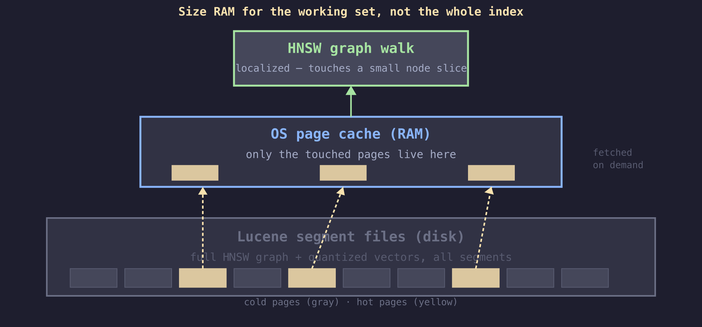

<!-- pause -->

**Why performance stays acceptable:**

- HNSW graph walks are **localized** — only touch a small fraction of nodes
- OS page cache keeps the hot paths resident
- Cold pages fetched on demand, not loaded upfront

<!-- pause -->

No hard "the whole index must fit in RAM" wall — size for the **working set**, not the entire index.

<span style="color: #6c7086">Not a DiskANN-style index (HNSW is the only algorithm) — just `mmap` giving graceful spill for free. RAM can sit on its own Search Nodes.</span>

<!-- end_slide -->

# Sizing: What Actually Needs to Be Hot

```
working set ≈ quantized vectors + HNSW graph
              (raw float vectors stay on disk)
```

<!-- pause -->

| per 1M × 1024d | size |
|---|---|
| raw float32 (on disk) | ~4 GB |
| binary-quantized (hot) | ~128 MB + graph |

<!-- pause -->

<span style="color: #f9e2af">Raw vectors stay on disk automatically when quantization is enabled — this is default behavior, not a config flag.</span>

<span style="color: #f9e2af">Size RAM for the *quantized* working set. That's the number that sets the bill.</span>

<span style="color: #6c7086">*Graph overhead varies — validate on the target corpus.*</span>

<!-- end_slide -->

# Lever ③ — Fewer *Bits* per Number

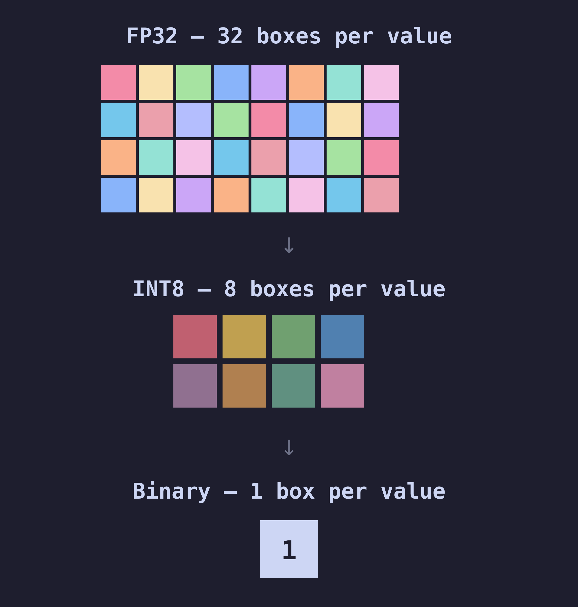

<!-- pause -->

<span style="color: #6c7086">Full precision is overkill for *finding* candidates. Keep it only for the final ranking.</span>

<!-- end_slide -->

# Search Blurry, Rank Sharp

<!-- column_layout: [1, 1] -->

<!-- column: 0 -->

**Search** — skim the thumbnails


<span style="color: #6c7086">binary vectors · fast · approximate</span>

<!-- column: 1 -->

**Rank** — open the full-res one


<span style="color: #6c7086">full-precision rescore · sharp</span>

<!-- reset_layout -->

<!-- pause -->

<span style="color: #f9e2af">Binary finds the neighbourhood fast → rescore those candidates at full precision → sharp final ranking.</span>

<span style="color: #6c7086">*(Widen `numCandidates` for more recall.)*</span>

<!-- end_slide -->

# `mongot` Quantizes Automatically

**Raw float vectors go in as-is — add one field to the index.**

```js
{ "fields": [{
    "type": "vector",
    "path": "embedding",
    "numDimensions": 1024,
    "similarity": "cosine",
    "quantization": "binary"   // or "scalar"
}]}
```

<!-- pause -->

- Done at **index-build time**, inside `mongot`
- **No change** to the ingestion pipeline
- Works on **existing** collections

<!-- pause -->

<span style="color: #a6e3a1">Raw vectors stay on disk. The compressed copy does the searching.</span>

<!-- end_slide -->

# Demo — Recall, Measured

**How do we write evals for a search system? We need a golden dataset — ground truth to grade against.**

<!-- pause -->

<span style="color: #f9e2af">MongoDB gives a way to generate one synthetically: exact search (ENN) *is* the answer key.</span>

<!-- pause -->

```
exact (ENN)             →  true top-10   (the answer key)

ANN numCandidates=10    →  recall@10 =  20%
ANN numCandidates=150   →  recall@10 =  50%
ANN numCandidates=500   →  recall@10 =  80%
ANN numCandidates=5000  →  recall@10 = 100%
```

<!-- pause -->

<span style="color: #a6e3a1">ANN and ENN live in the *same* `$vectorSearch` stage — grade the index natively, no external tool.</span>

<!-- pause -->

**Golden dataset pattern:**

1. Collect 100–500 representative queries
2. Run ENN (`exact: true`) to get ground-truth top-k for each
3. Store as golden eval set
4. Run weekly: compare ANN results against golden, compute recall
5. Alert if recall drops below threshold

<span style="color: #6c7086">No embedding API, no external service — MongoDB generates its own answer key.</span>

<!-- pause -->

<span style="color: #6c7086">Start `numCandidates` at **10–20 × `limit`**; raise it until measured recall plateaus. Hard cap: 10,000.</span>


<!-- end_slide -->

# Thank You

<!-- column_layout: [2, 1] -->

<!-- column: 0 -->


**Questions?**

<span style="color: #6c7086">📧 hello@noobj.me · 🌐 noobj.me</span>

<!-- column: 1 -->


<span style="color: #6c7086">🔗 github.com/itsnoobj/inside-mongodb-vector-db-architecture-talk</span>

<!-- reset_layout -->

<!-- end_slide -->

<!--
=====================================================================
 FULL DRAFT: Acts I–III + synthesis + close.
 Custom diagrams (SVG→PNG via rsvg-convert -w 2400):
   title-slide-mongodb, mongot-architecture, two-kitchens, topologies,
   quant-aware-training, query-through-layers, transition-{act1,act2,act3,recap,synthesis}.
 Reused: quantization-blocks, quantization-search-rerank, matryoshka-dolls,
   matryoshka-visual, three-levers, dimensions-growth, btree, filtered-search-problem-horizontal,
   qr-repo, gifs/{math-lady,measuring,mind-blown,where,hnsw-network,thank-you-bow}, cosine-similarity-angle.
 VOICE: second-person (you/your) removed from narration per author preference
   (kept only in "Thank You" courtesy + asset filenames).
 VERIFIED 2026-09-14 against mongodb.com / voyageai.com docs:
   ✓ mongot = separate Lucene process; syncs via change streams; mongod proxies; freshness = replication lag
   ✓ quantization: scalar int8 = 3.75x less RAM, binary 1-bit = 24x (not 32x; HNSW graph uncompressed), ~80% faster, rescoring
   ✓ $rankFusion (v8.1+) uses RRF; combines $vectorSearch + $search
   ✓ Voyage: quantization-aware training + Matryoshka (2048/1024/512/256); acq Feb 2025; Voyage 4 family shares one embedding space
   FIXED: voyage-context-4 -> voyage-context-3 (real model name); BinData "~3x smaller" -> documented ~38% storage cut
   Still conceptual (hedged on-slide, not doc-pinned): Lucene mmap/page-cache residency; "initial sync = full scan" wording; per-shard numCandidates; sizing table numbers
=====================================================================
-->
