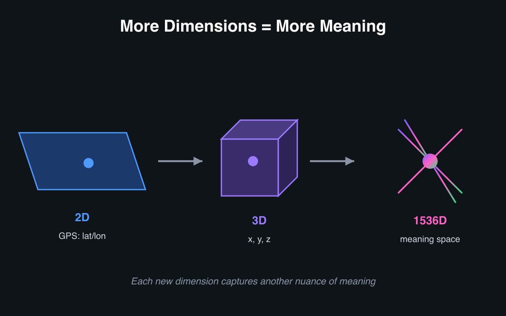
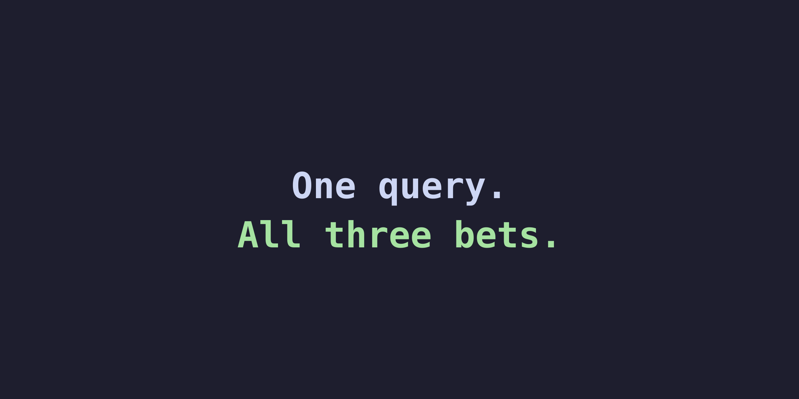

---
options:
  implicit_slide_ends: true
theme:
  override:
    footer:
      style: template
      left: "Jeevan | MongoDB HYD"
      right: "{current_slide} / {total_slides}"
---


<!-- end_slide -->

# This Is All It Takes

```js
db.docs.aggregate([
  { $vectorSearch: {
      index: "vector_index",
      path: "embedding",
      queryVector: [0.21, 0.87, ...],
      numCandidates: 200,
      limit: 10
  }}
])
```

<!-- pause -->

<span style="color: #f9e2af">Six lines. One stage.</span>

**This talk is everything under the waterline.**

<!-- pause -->

<span style="color: #6c7086">The goal: leave knowing the machine — not the API.</span>

<!-- end_slide -->

# Two Bets Hiding Under One Query

<!-- new_lines: 5 -->

<!-- column_layout: [1, 1] -->

<!-- column: 0 -->

## 🏗️ Architecture
*Where the index lives — and why it's not where it seems*

<!-- column: 1 -->

## 🗜️ Compression
*How billions of numbers fit in memory*

<!-- reset_layout -->

<!-- pause -->

<span style="color: #a6e3a1">Each one is a deliberate engineering bet. Let's open the box.</span>

<!-- end_slide -->

# &nbsp;


<!-- end_slide -->

# Recap: An Embedding Is Meaning as Numbers

<!-- column_layout: [3, 2] -->

<!-- column: 0 -->

```
"I love fries"     → [0.2, 0.8, 0.1, ...]
"Fries are great"  → [0.3, 0.7, 0.2, ...]
"The sky is blue"  → [0.9, 0.1, 0.8, ...]
```

<span style="color: #a6e3a1">Similar meaning → similar numbers.</span>

<!-- column: 1 -->


<!-- reset_layout -->

<!-- pause -->

<span style="color: #6c7086">A GPS coordinate for meaning. That's the whole trick.</span>

<!-- end_slide -->

# Recap: "Close" Is Just Distance

<!-- column_layout: [1, 1] -->

<!-- column: 0 -->

**Two points → Pythagoras**


`distance c = √(a² + b²)`

<!-- column: 1 -->

**Many dims → cosine** (direction, not length)


<!-- reset_layout -->

<!-- pause -->

<span style="color: #f9e2af">Same idea in 1024 dimensions — cosine compares *direction*, so vector length never distorts meaning.</span>

<!-- end_slide -->

# Recap: Why a Normal Index Can't Do This

<!-- column_layout: [1, 1] -->

<!-- column: 0 -->

**A B-tree sorts.** Binary search, O(log n).


<!-- column: 1 -->

**A vector has no sort order.**

```
A = [0.21, 0.87, ..., 0.53]
B = [0.93, 0.12, ..., 0.71]
```


<!-- reset_layout -->

<!-- pause -->

<span style="color: #f9e2af">No "less than" in 1024 dims → exact search checks every vector — too slow at scale.</span>

<!-- end_slide -->

# Recap: In MongoDB, a Vector Is Just a Field

```js
{
  _id: ObjectId("..."),
  title: "How to cancel my subscription",
  content: "Unsubscribe anytime from the account settings page...",
  embedding: [0.21, 0.87, 0.14, /* ...1024 numbers... */ 0.53]
}
```

<!-- pause -->

A normal document. A normal array.

<span style="color: #a6e3a1">**That's the input. Now — where does the *index* live?**</span>

<!-- end_slide -->

# A Stored Vector Is Inert

<!-- column_layout: [1, 1] -->

<!-- column: 0 -->

A vector saved in a document is just **data** — no `<` to sort on,
no `WHERE` clause that finds "nearest."

<!-- pause -->

**HNSW** links vectors into a navigable graph. Search **hops greedily**
toward the nearest neighbours — visiting a slice, not all N.

<!-- pause -->

- **ANN** — approximate: fast, ~99% as good as scanning everything
- `numCandidates` — how many nodes the walk visits (recall ↔ latency)

<!-- column: 1 -->


<!-- reset_layout -->

<!-- pause -->

<span style="color: #f9e2af">Storing the vector is trivial. The **index** is the hard part — and it's what `mongot` exists to build.</span>

<!-- end_slide -->

# &nbsp;


<!-- end_slide -->

# The Obvious Design

**Expectation:** the vector index lives *inside* the database — built as writes land, same process, same transaction.


<!-- pause -->

<span style="color: #f9e2af">MongoDB deliberately **doesn't** do this.</span>

<span style="color: #6c7086">And that one choice explains almost everything else.</span>

<!-- end_slide -->

# The Bet: A Second Process


<!-- pause -->

<span style="color: #a6e3a1">Two processes. One connection string.</span> <span style="color: #6c7086">The split is invisible to the app.</span>

<!-- end_slide -->

# Two Engines, Opposite Physics

**Why not just build the index into `mongod`? Because search and transactions want opposite things.**

<!-- pause -->

<!-- column_layout: [1, 1] -->

<!-- column: 0 -->

<span style="color: #4EC9B0">**`mongod` / WiredTiger**</span>

**Runtime** · C++
**Workload** · OLTP · point reads & writes · txns
**Storage** · mutable B-trees, updated in place
**Memory** · low-latency, steady

<!-- column: 1 -->

<span style="color: #4EC9B0">**Lucene (`mongot`)**</span>

**Runtime** · JVM
**Workload** · search · text + vector
**Storage** · immutable segments · merges · HNSW
**Memory** · memory-hungry, bursty, GC-driven

<!-- reset_layout -->

<!-- pause -->

Share one process and a search OOM takes down the database; a GC pause stalls writes.

<span style="color: #f9e2af">Different memory models, different failure domains → different processes.</span>

<!-- pause -->

<span style="color: #6c7086">And MongoDB didn't *write* a vector index — it reuses **Lucene** (20+ yrs of search, now with HNSW). One engine, two query types: `$search` (text) and `$vectorSearch`.</span>

<!-- end_slide -->

# How `mongot` Stays in Sync

**A downstream consumer of the change stream — in two phases.**

<!-- pause -->


<!-- pause -->

- No index work inside the transaction commit window
- Indexing runs **asynchronously**, off the hot path
- Writes never wait for the index

<!-- pause -->

<span style="color: #f9e2af">Search indexing is a **subscriber**, not a **passenger**.</span> <span style="color: #6c7086">Freshness = how far behind the stream `mongot` is.</span>

<!-- end_slide -->

# Nobody Talks to `mongot` Directly


<!-- pause -->

`mongot` scores and returns **just `{_id, score}`** — it doesn't store the documents, only the indexed fields. `mongod` stays the source of truth and **rehydrates** the full docs before the rest of the pipeline runs.

<!-- pause -->

<span style="color: #a6e3a1">Why IDs, not documents? No wholesale data duplication · `mongod` stays authoritative · results still flow into `$project` / `$lookup` after search.</span>

<span style="color: #6c7086">The cost: one id-lookup round trip. One connection string. (Sharded: `mongos` fans out and merges.)</span>

<!-- end_slide -->

# `$vectorSearch` Is Just a Pipeline Stage

```js
db.docs.aggregate([
  { $vectorSearch: { /* semantic + on-doc filter */ } },
  { $lookup:  { from: "users", localField: "userId", foreignField: "_id", as: "user" } },
  { $match:   { "user.plan": "pro" } },   // post-filter: joined field
  { $project: { title: 1, score: { $meta: "vectorSearchScore" } } }
])
```

<!-- pause -->

<span style="color: #a6e3a1">Results flow into `$lookup`, `$match`, `$group`, `$project` — joins, filters, reshaping, one query. Why a database, not a bolt-on vector store.</span>

<!-- pause -->

<span style="color: #f9e2af">But mind pre vs post:</span> <span style="color: #6c7086">a doc's *own* fields → pre-filter **inside** `$vectorSearch` (the `filter` field — next slide), or results get starved. A pipeline `$match` runs *after* search — right only for joined/derived data like `user.plan`.</span>

<!-- end_slide -->

# Filtering: *Where* It Runs Decides If It Works


<!-- pause -->

<span style="color: #f38ba8">Filter *after* search: HNSW returns its 10 nearest, the `$match` throws most away. Asked for 10, got 1.</span>

<!-- pause -->

<span style="color: #a6e3a1">The `filter` field pushes the predicate *inside* HNSW — the graph walk only visits matching docs.</span>

<!-- end_slide -->

# Demo — The Filter Trap

<!-- column_layout: [1, 1] -->

<!-- column: 0 -->

**Post-filter** — `$match` after
```js
$vectorSearch → $match:{tenant:42}
```
<span style="color: #f38ba8">Got: 0</span>

<!-- column: 1 -->

**Pre-filter** — `filter` inside
```js
$vectorSearch:{ filter:{tenant:42} }
```
<span style="color: #a6e3a1">Got: 10</span>

<!-- reset_layout -->

<!-- pause -->

<span style="color: #f9e2af">Same query, same data — the only change is *where* the filter runs.</span>

<span style="color: #6c7086">Live on local MongoDB: `mongod` + `mongot` in one container.</span>

<!-- end_slide -->

# Bonus: Text + Vector, One Engine

**`mongot` already indexes both. Fuse them in a single query.**

```js
db.docs.aggregate([
  { $rankFusion: { input: { pipelines: {
      vector: [ { $vectorSearch: { /* semantic */ } } ],
      text:   [ { $search:       { /* BM25 keyword */ } } ]
  }}}}
])
```

<!-- pause -->

<span style="color: #a6e3a1">Reciprocal Rank Fusion blends the two rankings — keyword precision + semantic recall.</span>

<span style="color: #6c7086">No second system, no sync: one Lucene engine serves both `$search` and `$vectorSearch`.</span>

<!-- end_slide -->

# The Two Kitchens


<!-- pause -->

<span style="color: #f9e2af">The prep kitchen can lag — but the line keeps serving at full speed.</span>

<!-- end_slide -->

# The Trade-off Is the Feature

**Because indexing is asynchronous, search can be *slightly* stale.**

```
  write committed ──▶ ...milliseconds... ──▶ searchable
                       (replication lag)
```

<!-- pause -->

<!-- column_layout: [1, 1] -->

<!-- column: 0 -->

<span style="color: #f38ba8">**The cost**</span>
Index freshness = f(replication lag)

<!-- column: 1 -->

<span style="color: #a6e3a1">**What it buys**</span>
Writes don't wait on indexing · search scales on its own

<!-- reset_layout -->

<!-- pause -->

<span style="color: #f9e2af">Eventual consistency for the index is a **choice**, not a bug — and usually the right one for search.</span>

<!-- end_slide -->

# Surviving a Crash: Resume Tokens

**What if `mongot` restarts mid-stream?**

<!-- pause -->

```
last processed change → resume token
        │
        ├─ still in the oplog window → resume, catch up
        │
        └─ history gone / lost state → re-sync (full rebuild)
```

<!-- pause -->

<span style="color: #a6e3a1">Usually it just catches up.</span> <span style="color: #f9e2af">Fall behind the oplog window and it rebuilds — queries stay up but read stale until it's caught up.</span>

<!-- end_slide -->

# Where Does `mongot` Run?


<!-- pause -->

<span style="color: #6c7086">Start co-located, isolate under load, shard to scale out — same query throughout. (Isolating = `mongot` on its own host; Atlas calls these Search Nodes.)</span>

<!-- pause -->

<span style="color: #f9e2af">Sharded: each shard runs its own `mongot` over its own data — HNSW is **per-shard**, so `numCandidates` applies per shard and `mongos` merges the scored results.</span>

<!-- end_slide -->

# Act I — The Mental Model

<!-- pause -->

**1.** The index doesn't live in the database. It lives in <span style="color: #4EC9B0">`mongot`</span>.

<!-- pause -->

**2.** It syncs by **subscribing to the change stream** — off the write path.

<!-- pause -->

**3.** `mongod` is just the **proxy**. The app never sees the split.

<!-- pause -->

**4.** Slight staleness is the deliberate price for **isolation + independent scaling**.

<!-- pause -->

<span style="color: #f9e2af">That one bet — two processes — shapes freshness, deployment, and scale.</span>

<!-- end_slide -->

# &nbsp;


<!-- end_slide -->

# Why Compression Isn't Optional

<!-- column_layout: [3, 2] -->

<!-- column: 0 -->

```
one vector:  1024 dims × 4 bytes ≈ 4 KB
```

| docs | just the vectors |
|------|------------------|
| 1M   | ~4 GB |
| 10M  | ~40 GB |
| 100M | ~400 GB |

<!-- column: 1 -->


<!-- reset_layout -->

<!-- pause -->

<span style="color: #f38ba8">HNSW wants those vectors in RAM.</span> <span style="color: #f9e2af">RAM is the bill.</span>

<!-- end_slide -->

# Three Levers, Not One


<!-- pause -->

<span style="color: #6c7086">Quantization is just the loudest lever.</span>

<!-- end_slide -->

# Lever ① — Fewer *Numbers*



<!-- pause -->

RAM scales with dimensions. Halve them → halve the vector RAM.

<!-- pause -->

<span style="color: #6c7086">Matryoshka (MRL) training packs the meaning into the front dims — so truncating is safe.</span>

<!-- end_slide -->

# Lever ② — Not All of It Has to Be in RAM

**`mongot` is Lucene. Lucene reads its index through `mmap`.**

```
Lucene segment files  ── on disk ──┐
                                   ▼
                            OS page cache
              hot pages resident · cold pages fetched on demand
```

<!-- pause -->

No hard "the whole index must fit in RAM" wall — size for the **working set**, not the entire index.

<!-- pause -->

<span style="color: #6c7086">Not a DiskANN-style index (HNSW is the only algorithm) — just `mmap` giving graceful spill for free. And since it all lives in `mongot`, that RAM can sit on its own Search Nodes.</span>

<!-- end_slide -->

# Lever ③ — Fewer *Bits* per Number


<!-- pause -->

<span style="color: #6c7086">Full precision is overkill for *finding* candidates. Keep it only for the final ranking.</span>

<!-- end_slide -->

# `mongot` Quantizes Automatically

**Raw float vectors go in as-is — add one field to the index.**

```js
{ "fields": [{
    "type": "vector",
    "path": "embedding",
    "numDimensions": 1024,
    "similarity": "cosine",
    "quantization": "binary"   // or "scalar"
}]}
```

<!-- pause -->

- Done at **index-build time**, inside `mongot`
- **No change** to the ingestion pipeline
- Works on **existing** collections

<!-- pause -->

<span style="color: #a6e3a1">Raw vectors stay on disk. The compressed copy does the searching.</span>

<!-- end_slide -->

# Search Blurry, Rank Sharp

<!-- column_layout: [1, 1] -->

<!-- column: 0 -->

**Search** — skim the thumbnails


<span style="color: #6c7086">binary vectors · fast · approximate</span>

<!-- column: 1 -->

**Rank** — open the full-res one


<span style="color: #6c7086">full-precision rescore · sharp</span>

<!-- reset_layout -->

<!-- pause -->

<span style="color: #f9e2af">Binary finds the neighbourhood fast → rescore those candidates at full precision → sharp final ranking.</span>

<span style="color: #6c7086">*(Widen `numCandidates` for more recall.)*</span>

<!-- end_slide -->

# Sizing: What Actually Needs to Be Hot

```
working set ≈ quantized vectors + HNSW graph
              (raw float vectors stay on disk)
```

<!-- pause -->

| per 1M × 1024d | size |
|---|---|
| raw float32 (on disk) | ~4 GB |
| binary-quantized (hot) | ~128 MB + graph |

<!-- pause -->

<span style="color: #f9e2af">Size RAM for the *quantized* working set — not the raw vectors. That's the number that sets the bill.</span>

<span style="color: #6c7086">*Graph overhead varies — validate on the target corpus.*</span>

<!-- end_slide -->

# Demo — Recall, Measured

```
exact (ENN)            →  true top-10   (the answer key)

ANN numCandidates=10   →  recall@10 = 90%
ANN numCandidates=200  →  recall@10 = 100%
```

<!-- pause -->

<span style="color: #a6e3a1">ANN and ENN live in the *same* `$vectorSearch` stage — grade the index natively, no external tool.</span>

<span style="color: #6c7086">Live on local MongoDB.</span>

<!-- end_slide -->

# &nbsp;



<!-- end_slide -->

# What's Now Clear

<!-- pause -->

**🏗️** The index lives in <span style="color: #4EC9B0">`mongot`</span>, fed by the change stream — not in the DB.

<!-- pause -->

**🗜️** `mongot` quantizes at build time; it searches blurry and ranks sharp.

<!-- pause -->

<span style="color: #f9e2af">In: the API. Out: the machine.</span>

<!-- end_slide -->

# Thank You

<!-- column_layout: [2, 1] -->

<!-- column: 0 -->


**Questions?**

<span style="color: #6c7086">MongoDB 8.2+ · Community & Enterprise · self-managed on supported Linux (Docker/tarball) or Atlas.</span>

<!-- column: 1 -->


<span style="color: #6c7086">Slides & notes</span>

<!-- reset_layout -->

<!-- end_slide -->

<!--
=====================================================================
 FULL DRAFT: Acts I–III + synthesis + close.
 Custom diagrams (SVG→PNG via rsvg-convert -w 2400):
   title-slide-mongodb, mongot-architecture, two-kitchens, topologies,
   quant-aware-training, query-through-layers, transition-{act1,act2,act3,recap,synthesis}.
 Reused: quantization-blocks, quantization-search-rerank, matryoshka-dolls,
   matryoshka-visual, three-levers, dimensions-growth, btree, filtered-search-problem-horizontal,
   qr-repo, gifs/{math-lady,measuring,mind-blown,where,hnsw-network,thank-you-bow}, cosine-similarity-angle.
 VOICE: second-person (you/your) removed from narration per author preference
   (kept only in "Thank You" courtesy + asset filenames).
 VERIFIED 2026-09-14 against mongodb.com / voyageai.com docs:
   ✓ mongot = separate Lucene process; syncs via change streams; mongod proxies; freshness = replication lag
   ✓ quantization: scalar int8 = 3.75x less RAM, binary 1-bit = 24x (not 32x; HNSW graph uncompressed), ~80% faster, rescoring
   ✓ $rankFusion (v8.1+) uses RRF; combines $vectorSearch + $search
   ✓ Voyage: quantization-aware training + Matryoshka (2048/1024/512/256); acq Feb 2025; Voyage 4 family shares one embedding space
   FIXED: voyage-context-4 -> voyage-context-3 (real model name); BinData "~3x smaller" -> documented ~38% storage cut
   Still conceptual (hedged on-slide, not doc-pinned): Lucene mmap/page-cache residency; "initial sync = full scan" wording; per-shard numCandidates; sizing table numbers
=====================================================================
-->
